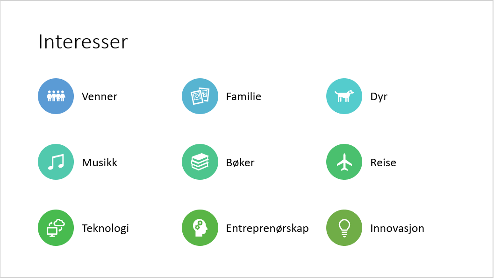

<html lang="en">

<head>
<meta name="viewport" content="width=device-width, initial-scale=1">

<title>Bootstrap Example</title>
  <meta charset="utf-8">
  <meta name="viewport" content="width=device-width, initial-scale=1">
  <link rel="stylesheet" href="https://maxcdn.bootstrapcdn.com/bootstrap/4.4.1/css/bootstrap.min.css">
  
  
  
  
</head>

<body>
 

<ul>
  <li><a class="active" href="#home">Om meg</a></li>
  <li><a href="#cv">CV</a></li>
  <li><a href="#pres">Presentasjon</a></li>
</ul>
  

  

    <h1 style="color:white;">Om meg</h1>
  

  

  

    

      <h3>Ferdigheter</h3>
      
Lorem ipsum dolor sit amet, consectetur adipisicing elit...

      
Ut enim ad minim veniam, quis nostrud exercitation ullamco laboris...

    

    

      <h3>Egenskaper</h3>
      
- Kreativ

      
- Tenke nytt

      
- Strukturert

      
- Jobber bra under press

    

    

      <h3>Erfaring</h3>        
      
Lorem ipsum dolor sit amet, consectetur adipisicing elit...

      
Ut enim ad minim veniam, quis nostrud exercitation ullamco laboris...

    

  

  
1 / 3

  
  
Caption Text

  
2 / 3

  
  
Caption Two

  
3 / 3

  
  
Caption Three

<a class="prev" onclick="plusSlides(-1)">&#10094;</a>
<a class="next" onclick="plusSlides(1)">&#10095;</a>

 

   
   
   

</body>
</html>
